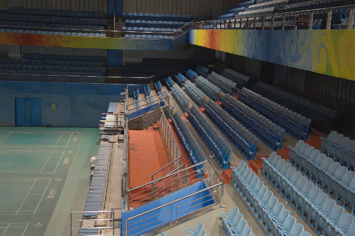

# MacNet
## News 💡
- **2025.06.14** LOLv2_real and LOLv2_syn Results Upload！
"Multi-Scale Alternating Compensation Network with Illumination Smoothness for Low-Light Image Enhancement"
- **2025.06.12** Continuously updating！
"Multi-Scale Alternating Compensation Network with Illumination Smoothness for Low-Light Image Enhancement"
- **2025.06.10** LOLv1 Results Upload！
"Multi-Scale Alternating Compensation Network with Illumination Smoothness for Low-Light Image Enhancement"
- **2025.01.15** Coming soon！
"Multi-Scale Alternating Compensation Network with Illumination Smoothness for Low-Light Image Enhancement"
# Results

## LOL_v1

  
  
  
  
  

  
  
  
  
  

  
  
  
  
  

